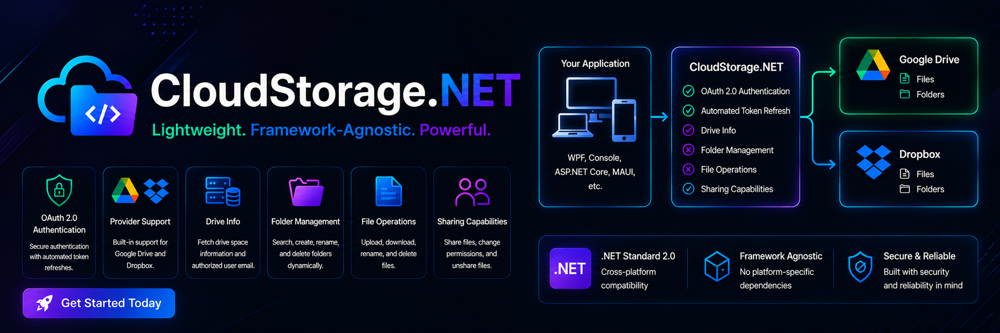

# CloudStorage.NET

**CloudStorage.NET** is a lightweight, framework-agnostic .NET Standard 2.0 library for working with cloud storage services such as Google Drive and Dropbox from any .NET application. It is designed to support WPF, Console, ASP.NET Core, MAUI, and other platforms with no platform-specific UI dependencies.




## Table of Contents

- [Features](#features)
- [Installation](#installation)
- [Quick Start](#quick-start)
  - [1. Configuration](#1-configuration)
  - [2. Authentication](#2-authentication)
  - [3. File Operations](#3-file-operations)
- [Project Structure](#project-structure)
- [Contributing](#contributing)
- [License](#license)

## Features

- **OAuth 2.0 Authentication**: Seamless authentication and authorization with automatic token refresh.
- **Drive Info**: Retrieve total and used storage, user email, and drive metadata.
- **Folder Management**: Search, create, rename, and delete folders.
- **File Operations**: Upload, download, rename, move, and delete files.
- **Sharing Capabilities**: Manage file permissions, share, and unshare files.
- **Google Picker Integration**: Includes a lightweight local server for Google Picker support.
- **Multiple Cloud Providers**: Support for Google Drive and Dropbox.
- **Cross-platform**: Compatible with .NET Standard 2.0 and usable in desktop, web, and mobile applications.

## Installation

Use one of the following approaches:

1. Reference the project directly in your solution.
2. Build the `.nupkg` package and add it to a local NuGet source.

### Project reference example

```xml
<ProjectReference Include="..\CloudStorage.Net\CloudStorage.Net.csproj" />
```

### Required files

- `google_drive_client_secret.json` — Google API client secret file
- `dropbox_app_secrets.json` — Dropbox API credentials file
- `token.json` — OAuth token cache file generated at runtime (provider-specific)

## Quick Start

### 1. Configuration

Create a `GoogleDriveConfig` instance with your application settings.

```csharp
using CloudStorage.Net;

var config = new GoogleDriveConfig
{
    RootFolderName = "MyApplicationFolder",
    GoogleDriveAppName = "MyGoogleDriveApp",
    GoogleDriveTokenFile = "token.json",
    ClientSecretPath = "google_drive_client_secret.json",
    GoogleDriveMusic = "Downloads"
};
```

> Note: This example is for Google Drive. For Dropbox, use `DropboxConfig` and `DropboxManager`.

### 2. Authentication

Instantiate `GoogleDriveManager`, authenticate, and create the root folder.

```csharp
using (var driveManager = new GoogleDriveManager(config))
{
    driveManager.LogCallback = (tag, message) => Console.WriteLine($"[{tag}]: {message}");

    bool authenticated = await driveManager.AuthenticateDrive();
    if (authenticated)
    {
        Console.WriteLine("Successfully connected to Google Drive!");
        bool rootCreated = await driveManager.CreateCloudDriveRootFolder();
    }
}
```

### 3. File Operations

#### Upload a File

```csharp
bool uploaded = await driveManager.UploadFile("path/to/local/file.txt", "parentFolderId");
```

#### Download a File

```csharp
var fileToDownload = new CloudFileModel
{
    FileId = "google-drive-file-id"
};

bool downloaded = await driveManager.DownloadFile(fileToDownload, "path/to/save/local/file.txt");
```

#### List Files in a Folder

```csharp
var folderInfo = new CloudDriveDirInfo { DirId = "google-drive-folder-id" };
var files = await driveManager.GetFiles(folderInfo, onlyRetrieveFirstFile: false);

foreach (var file in files)
{
    Console.WriteLine($"File: {file.FileName} (ID: {file.FileId}, Size: {file.FileSize} bytes)");
}
```

## Project Structure

- `CloudStorage.Net.csproj` — core cloud storage library
- `GoogleDriveConfig.cs` — configuration options for Google Drive integration
- `GoogleDriveManager.cs` — main manager implementation for Google Drive operations
- `DropboxConfig.cs` / `DropboxManager.cs` — Dropbox integration
- `CloudStorage.GoogleDrive/` — Google Drive service wrapper
- `CloudStorage.Dropbox/` — Dropbox service wrapper
- `CloudDrive*.cs` — shared cloud storage models and abstractions
- `CloudStorage.Net.TestConsole/` — sample console application for testing and demo

## Contributing


## License

This project is provided under the MIT License. See the repository license file for details.
